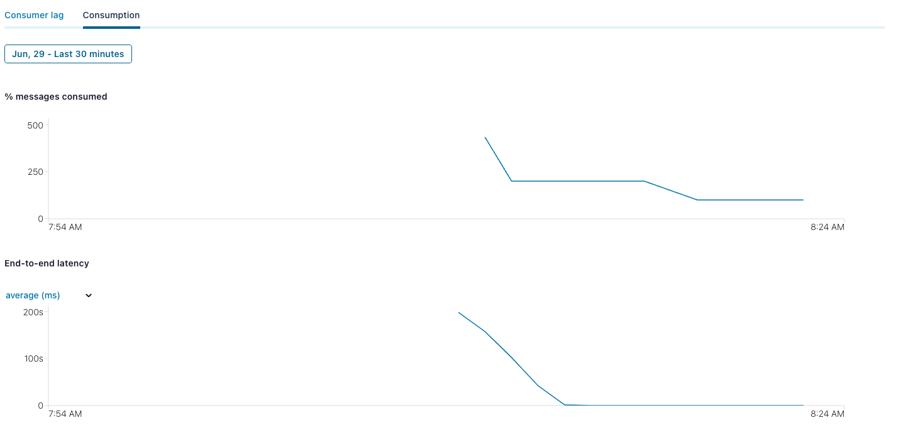

# Metrics

In order, to see some insight metrics we distinguish between Confluent Metrics Reporter and
JMX (Java Management Extensions).

## Confluent Metrics Reporter

Simply add parameters to the environment of the broker.

```shell
KAFKA_METRIC_REPORTERS: io.confluent.metrics.reporter.ConfluentMetricsReporter
CONFLUENT_METRICS_REPORTER_BOOTSTRAP_SERVERS: broker:29092
CONFLUENT_METRICS_REPORTER_TOPIC_REPLICAS: 1
```
We then can see a dashboard in the control-center (`localhost:9021`):


## JMX

We can export metrics from the broker and/or ksqlDB by adjusting related parameters in the
docker-compose file. Open `jconsole` and see those metrics.
With the JMX-exporter, we export desired metrics so that we finally can scrape them with
Prometheus. A possible extension might be using Grafana to visualize the metrics in a
dashboard. However, we focussed here more on only exposing rather than using.

We can either monitor all metrics under `localhost:5556` from the JXM-exporter
or in Prometheus under `localhost:9090`.

I used the code from the [streamthoughts GitHub repository](https://github.com/streamthoughts/kafka-monitoring-stack-docker-compose/tree/master/etc/jmx_exporter)
for exporting the metrics.

## Interceptors

We add interceptors to the KafkaProducer and to the KafkaStreams application.
So we can check if we lose data along the pipeline as well as how the end-to-end latency
is. A good indicator is also always the consumer lag.




