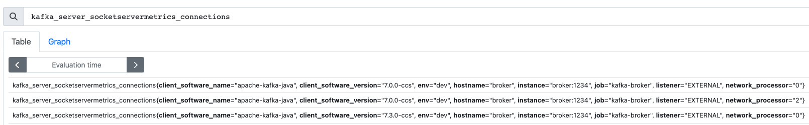

# Metrics in Control Center (C3)

We want to set up the configuration to see
some metrics in C3.
For more metrics from clients and the components, we refer
to [kafka-platform-prometheus repository](https://github.com/jeanlouisboudart/kafka-platform-prometheus),
where JMX metrics are exported and then scraped by Prometheus. 

## Broker Metrics

We use the [Metrics Reporter](https://docs.confluent.io/platform/current/kafka/metrics-reporter.html#cmetric-full)
to see some broker metrics in C3.
Simply, add these parameters to the environment of the broker.

```yaml
KAFKA_METRIC_REPORTERS: io.confluent.metrics.reporter.ConfluentMetricsReporter
CONFLUENT_METRICS_REPORTER_BOOTSTRAP_SERVERS: broker:29092
CONFLUENT_METRICS_REPORTER_TOPIC_REPLICAS: 1
```


## Client Metrics via Monitoring Interceptor

We use [Monitoring Interceptors](https://docs.confluent.io/platform/current/control-center/installation/clients.html#confluent-monitoring-interceptors-in-c3-short)
to see message consumed (%) and end-to-end latency as consumer group metrics in C3. 

Therefore, we need to add the plugin to the corresponding Gradle file.
```kts
implementation("io.confluent:monitoring-interceptors:7.3.0")
```

Then for the Producer, we add the configuration:

````kotlin
settings.setProperty(ProducerConfig.INTERCEPTOR_CLASSES_CONFIG, "io.confluent.monitoring.clients.interceptor.MonitoringProducerInterceptor")
````

And for Kafka Streams, we add the configuration:

````kotlin
settings[StreamsConfig.PRODUCER_PREFIX + ProducerConfig.INTERCEPTOR_CLASSES_CONFIG] =
    "io.confluent.monitoring.clients.interceptor.MonitoringProducerInterceptor"
settings[StreamsConfig.MAIN_CONSUMER_PREFIX + ConsumerConfig.INTERCEPTOR_CLASSES_CONFIG] =
    "io.confluent.monitoring.clients.interceptor.MonitoringConsumerInterceptor"
````


# JMX Metrics

We want to monitor the client versions via the JMX broker metrics as explained in [KIP-511](https://cwiki.apache.org/confluence/display/KAFKA/KIP-511%3A+Collect+and+Expose+Client%27s+Name+and+Version+in+the+Brokers#KIP511:CollectandExposeClient'sNameandVersionintheBrokers-ApiVersionsRequest/ResponseHandling.1).
Therefore, we add additional components (node exporter and Prometheus) to the setup.
More information can be found in the [jmx-monitoring-stacks repository](https://github.com/confluentinc/jmx-monitoring-stacks).

We then enter Prometheus under `localhost:9090` and 
see then the desired metrics under the name `kafka_server_socketservermetrics_connections`.

