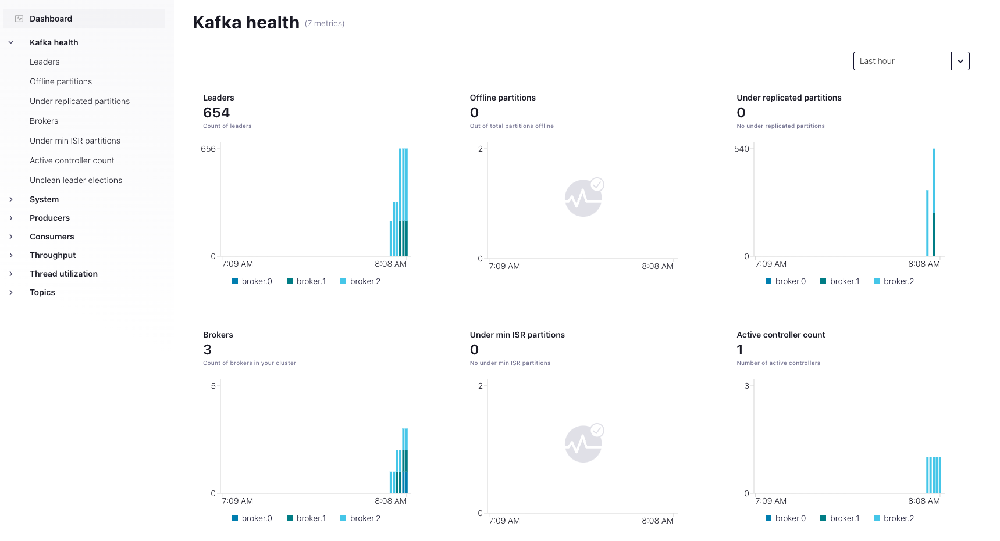

# Think of ksqlDB before using Kafka Streams

[![LinkedIn][linkedin-shield]][linkedin-url]

A streaming data pipeline typically consists of data transformation, wrangling, and (time-based window) aggregation. On top of that, we must also guarantee data integrity. One might think of [Kafka Streams](https://kafka.apache.org/documentation/streams/) to solve all these challenges, and it is definitely a good choice. However, in many cases, [ksqlDB](https://ksqldb.io/) queries are simpler, faster to implement, and work fine.

This repository was used in a Confluent meetup. You can watch the recording in the [Community Forum](https://forum.confluent.io/t/recording-ready-to-view-speaker-q-a-thread-30-march-2022-think-of-using-ksqldb-before-using-kafka-streams/4450).


## Run on Confluent for Kubernetes (CFK) with Minikube

### Prerequisites
* Helm
* Minikube
* Docker
* kubectl


### Environment
Start k8s cluster with: 
```shell
minikube start --cpus=6 --disk-size='100gb' --memory=max
```

Follow the instructions (1 & 2) on [Quickstart](https://docs.confluent.io/operator/current/co-quickstart.html)
to create a `confluent` namespace and to install CFK.

Deploy Kafka components with:
```shell
kubectl apply -f ./confluent-platform.yaml
```

### Deployment

Build images:
```shell
docker build -t kafkaproducermeetup22:0.1.0 .
docker build -t kafkastreamsmeetup22:0.1.0 .
```

We need to load the images into the minikube cluster:
```shell
minikube image load kafkaproducermeetup22:0.1.0
minikube image load kafkastreamsmeetup22:0.1.0
```

Then we deploy images, e.g.:
```shell
kubectl apply -f ./KafkaProducer/Deployment.yaml
kubectl apply -f ./KafkaStreams/Deployment.yaml
```

### See the data


We do a port forwarding to the control center:
```shell
kubectl port-forward controlcenter-0 9021:9021 -n confluent
```
We can then see the data flow in the control center under:
```localhost:9021```. 

## Health+

Generally, create an API Key and API Secret for Health+ and store them in `telemetry.txt`  as explained in the [documentation](https://docs.confluent.io/platform/current/health-plus/telemetry.html).

Deploy the `telemetry.txt` in k8s

```shell
kubectl create secret generic telemetry \--from-file=telemetry.txt=./telemetry.txt
```

For CFK, we need to adjust the `./CFK/confluent-for-kubernetes/values.yaml` by configuring the telemetry section as explained in the [documentation](https://docs.confluent.io/operator/current/co-monitor-cp.html).
````yaml
telemetry:
  operator:
    enabled: true
  enabled: true
  proxy:
    enabled: false
    credentialRequired: false
  secretRef: "telemetry"
````

We apply the changes and restart CFK

````shell
helm upgrade --install confluent-operator \
  confluentinc/confluent-for-kubernetes \
  --values ./CFK/confluent-for-kubernetes/values.yaml \
  --namespace confluent
````

```shell
kubectl rollout restart deployment/confluent-operator
```

Let's wait until the Kafka brokers have been updated successfully (done automatically).
We can then see the Health+ dashboard:




## Sources

* [CFK Quickstart](https://docs.confluent.io/operator/current/co-quickstart.html)
* [Minikube Deployment](https://stackoverflow.com/questions/42564058/how-to-use-local-docker-images-with-minikube)
* [Health+](https://docs.confluent.io/operator/current/co-monitor-cp.html)


[linkedin-shield]: https://img.shields.io/badge/-LinkedIn-black.svg?style=flat-square&logo=linkedin&colorB=555
[linkedin-url]: https://www.linkedin.com/in/patrick-neff-7bb3b21a4/