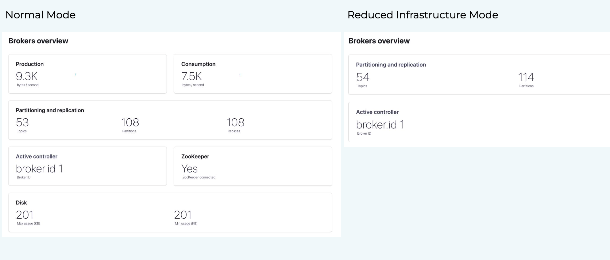
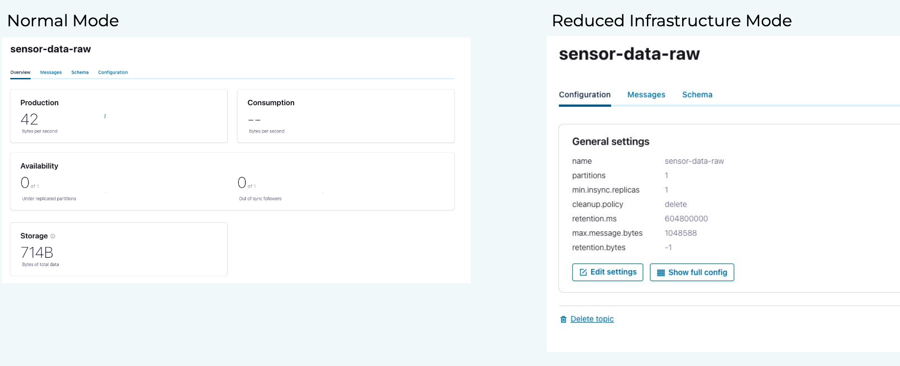

# Think of ksqlDB before using Kafka Streams

[![LinkedIn][linkedin-shield]][linkedin-url]

A streaming data pipeline typically consists of data transformation, wrangling, and (time-based window) aggregation. On top of that, we must also guarantee data integrity. One might think of [Kafka Streams](https://kafka.apache.org/documentation/streams/) to solve all these challenges, and it is definitely a good choice. However, in many cases, [ksqlDB](https://ksqldb.io/) queries are simpler, faster to implement, and work fine.

This repository was used in a Confluent meetup. You can watch the recording in the [Community Forum](https://forum.confluent.io/t/recording-ready-to-view-speaker-q-a-thread-30-march-2022-think-of-using-ksqldb-before-using-kafka-streams/4450).


## Run locally with Docker

Start entire Kafka environment with:
```shell
docker-compose up -d
```
We can then see the data flow in the control center under:
```localhost:9021```. 

### Kafka Streams

We use [Gradle](https://gradle.org/) to build and run the Kafka Streams application:

```shell
./gradlew run
```

### ksqlDB

In order to execute all statements, we need to open the ksqlDB client with:

```shell
docker exec -it ksqldb-cli ksql http://ksqldb-server:8088
```

## C3 Mode
We set the C3 mode to reduced infrastructure via
```shell
CONTROL_CENTER_MODE_ENABLE: "management"
```
This will reduce the number of internal topics and partitions from 54 to 6 and 114 to 66, respectively.





## Sources


* [C3 Configuration](https://docs.confluent.io/platform/current/control-center/installation/configure-control-center.html#modes)
* [C3 Mode Overview](https://docs.confluent.io/platform/current/control-center/index.html#reduced-infra-mode)

[linkedin-shield]: https://img.shields.io/badge/-LinkedIn-black.svg?style=flat-square&logo=linkedin&colorB=555
[linkedin-url]: https://www.linkedin.com/in/patrick-neff-7bb3b21a4/
