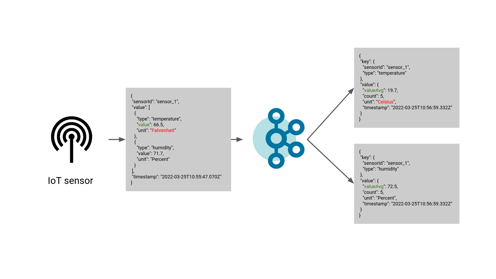
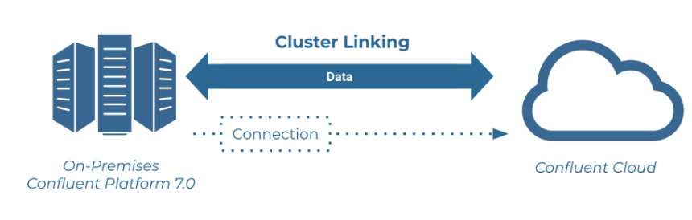
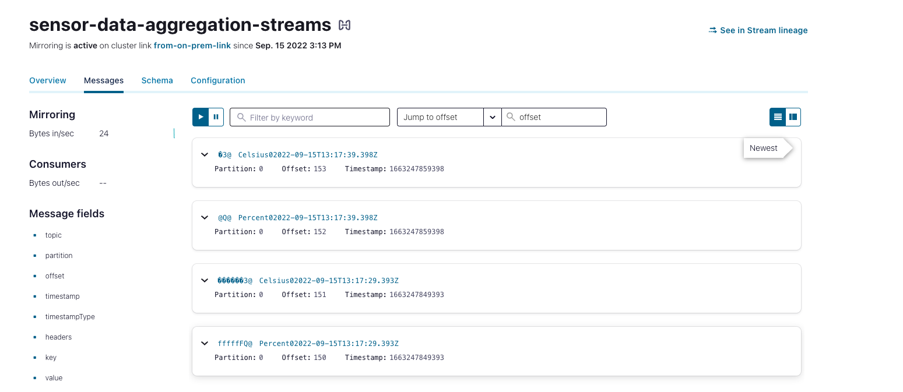

# Think of ksqlDB before using Kafka Streams

[![LinkedIn][linkedin-shield]][linkedin-url]

A streaming data pipeline typically consists of data transformation, wrangling, and (time-based window) aggregation. On top of that, we must also guarantee data integrity. One might think of [Kafka Streams](https://kafka.apache.org/documentation/streams/) to solve all these challenges, and it is definitely a good choice. However, in many cases, [ksqlDB](https://ksqldb.io/) queries are simpler, faster to implement, and work fine.

This repository was used in a Confluent meetup. You can watch the recording in the [Community Forum](https://forum.confluent.io/t/recording-ready-to-view-speaker-q-a-thread-30-march-2022-think-of-using-ksqldb-before-using-kafka-streams/4450).




## Run on a Hybrid Environment

We will run this pipeline locally but then use Cluster Linking to transfer the data into Confluent
Cloud. A possible scenario would be a sensor not having internet connection all the time.
We ensure that the data can be analyzed locally but for bigger analytics or disaster recovery, it is 
also transferred to CC once it has a stable connectivity.

We follow this [tutorial](https://docs.confluent.io/cloud/current/multi-cloud/cluster-linking/hybrid-cc.html#mirror-data-from-on-premises-to-ccloud).
Ensure to have a dedicated Confluent Cloud cluster running.



### Start running locally with Docker

We need to set:
```yaml
KAFKA_PASSWORD_ENCODER_SECRET: encoder-secret
```
Then start the entire Kafka environment with:
```shell
docker-compose up -d
```
We can then see the data flow in the control center under:
```localhost:9021```.

#### Kafka Streams

We use [Gradle](https://gradle.org/) to build and run the Kafka Streams application:

```shell
./gradlew run
```

### Create Cluster Link in the dedicated cluster in CC

We need the clusterId from our local environment:
```shell
kafka-cluster cluster-id --bootstrap-server localhost:9092
```
We need the clusterId from the dedicated CC cluster (navigate to the environment and cluster):
```shell
confluent kafka cluster describe
```
We create the cluster link by providing an additional configuration file.
More information about the configuration can be found in the [documentation](https://docs.confluent.io/platform/current/multi-dc-deployments/cluster-linking/configs.html#configuration-options).

```shell
confluent kafka link create from-on-prem-link \
--cluster <CC Cluster Id> \
--source-cluster-id <CP Cluster Id> \
--config-file ./ClusterLinking/CloudClusterLinkConfig.txt
```

### Create Cluster Link in your local environment

We first need to create an API Key, so that we can authenticate the cluster link at CC.
```shell
confluent api-key create --resource <CC Cluster Id>
```
We create the cluster link by providing an additional configuration file.
Do not add any cluster link configurations (such as consumer offset sync or auto-create mirror topics) to 
LocalConfig.txt.
These configurations must be set on the destination’s cluster link 
(not the Source cluster’s cluster link).
```shell
kafka-cluster-links --bootstrap-server localhost:9092 \
--create --link from-on-prem-link \
--config-file ./ClusterLinking/LocalClusterLinkConfig.txt \
--cluster-id <CC Cluster Id>
```

### Validate the Cluster Linking
It may take some time until all mirror topics are created. However, finally you can see the 
data also running in Confluent Cloud.




## Sources

* [Tutorial Cluster Linking](https://docs.confluent.io/cloud/current/multi-cloud/cluster-linking/hybrid-cc.html#mirror-data-from-ccloud-to-on-premises)
* [Cluster Link Configuration](https://docs.confluent.io/platform/current/multi-dc-deployments/cluster-linking/configs.html#configuration-options)


[linkedin-shield]: https://img.shields.io/badge/-LinkedIn-black.svg?style=flat-square&logo=linkedin&colorB=555
[linkedin-url]: https://www.linkedin.com/in/patrick-neff-7bb3b21a4/