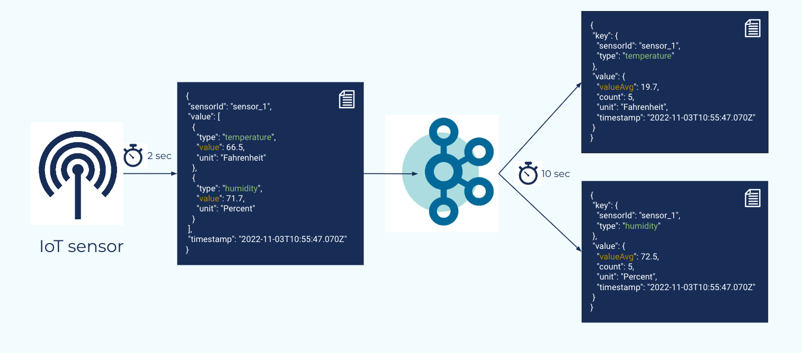
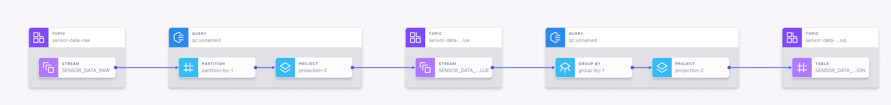

# Think of ksqlDB before using Kafka Streams - Stream Designer Edition

[![LinkedIn][linkedin-shield]][linkedin-url]

A streaming data pipeline typically consists of data transformation, wrangling, and (time-based window) aggregation. On top of that, we must also guarantee data integrity. One might think of [Kafka Streams](https://kafka.apache.org/documentation/streams/) to solve all these challenges, and it is definitely a good choice. However, in many cases, [ksqlDB](https://ksqldb.io/) queries are simpler, faster to implement, and work fine.

This repository was used in a Confluent meetup to present the [Stream Designer](https://docs.confluent.io/cloud/current/stream-designer/index.html#sd).




## Run on Confluent Cloud

We run the application on Confluent Cloud (CC). Therefore, we need to provide additional
configurations for the clients. A good start of how to deploy services in CC can be found
[here](https://docs.confluent.io/cloud/current/client-apps/config-client.html).
Credentials are encrypted via [blackbox](https://github.com/StackExchange/blackbox#installation-instructions)
and need to be inserted in the corresponding property files.

### Kafka Producer

We use [Gradle](https://gradle.org/) to build and run the application:

```shell
./gradlew run
```

### Stream Designer



You can create streams and tables via the UI or via the code console.


## Sources

* [Client Config](https://docs.confluent.io/cloud/current/client-apps/config-client.html)
* [Stream Designer](https://docs.confluent.io/cloud/current/stream-designer/index.html#sd)

[linkedin-shield]: https://img.shields.io/badge/-LinkedIn-black.svg?style=flat-square&logo=linkedin&colorB=555
[linkedin-url]: https://www.linkedin.com/in/patrick-neff-7bb3b21a4/

