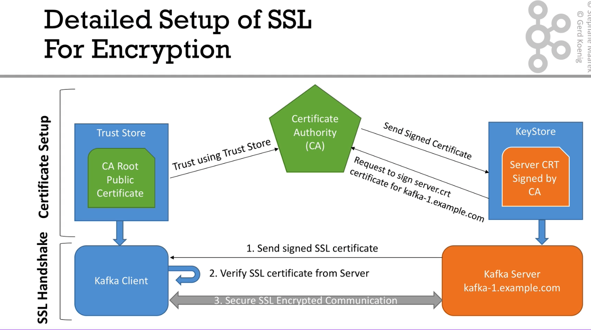

# SSL Encryption



## 1. Create certificates and stores

### Certificate Authority (CA)
Create Certificate Authority certificate (public) `ca-cert` and private key `ca-key`.
This one is an external service in real business cases.

```shell
openssl req -new -newkey rsa:4096 -x509 -subj "/CN=Kafka-Security-CA" -keyout ca-key -out ca-cert -nodes -days 36500
```

* _change the directory to the specific broker creds folder_

### Key Store
Create Key Store `kafka.server.keystore.jks`. This is the most critical part. When you can't connect via ssl later on
successfully, a wrong Key Store is most likely the reason.

```shell
keytool -genkey -noprompt -dname "CN=localhost" -keystore kafka.server.keystore.jks -keyalg RSA -storepass secret -keypass secret -validity 36500
```
Create a certificate `cert-file` in the Key Store (which should be signed)
```shell
keytool -keystore kafka.server.keystore.jks -certreq -file cert-file -storepass secret -keypass secret
```
Let the certificate from the Key Store signed by the CA `cert-signed`
```shell
openssl x509 -req -CA ../CA/ca-cert -CAkey ../CA/ca-key -in cert-file -out cert-signed -days 36500 -CAcreateserial -passin pass:secret
```
Import CA certificate and signed certificate into the Key Store
```shell
keytool -keystore kafka.server.keystore.jks -alias CARoot -import -file ../CA/ca-cert -storepass secret -keypass secret -noprompt
keytool -keystore kafka.server.keystore.jks -import -file cert-signed -storepass secret -keypass secret -noprompt
```

### Trust Store

Create a Trust Store in which we replace the signed certificate `kafka.server.truststore.jks`
```shell
keytool -keystore kafka.server.truststore.jks -alias CARoot -import -file ../CA/ca-cert -storepass secret -keypass secret -noprompt
```

### Useful commands

In order to inspect certain files, use

```shell
keytool -printcert -v -file cert-signed
keytool -list -v -keystore kafka.server.keystore.jks
```


## 2. Setting up Broker configurations

* Add a new `advertised.listener=SSL://localhost:19093` and open the related port.
* Mount the created stores into `/etc/kafka/secrets`
* Set the configs to
```yaml
KAFKA_SSL_KEYSTORE_FILENAME: kafka.server.keystore.jks
KAFKA_SSL_KEYSTORE_CREDENTIALS: credentials
KAFKA_SSL_KEY_CREDENTIALS: credentials
KAFKA_SSL_TRUSTSTORE_FILENAME: kafka.server.truststore.jks
KAFKA_SSL_TRUSTSTORE_CREDENTIALS: credentials
```

Check connection with SSL via:
```shell
openssl s_client -connect localhost:19093
```

## 3. Configure Clients

We need to create a Trust Store in which we insert the CA certificate (analog to the server site)
```shell
keytool -keystore kafka.client.truststore.jks -alias CARoot -import -file ../CA/ca-cert -storepass secret -keypass secret -noprompt
```

We also need to add additional configurations and change the port of the `bootstrap.servers`
```kotlin
settings.setProperty(CommonClientConfigs.SECURITY_PROTOCOL_CONFIG, "SSL")
settings.setProperty(SslConfigs.SSL_TRUSTSTORE_PASSWORD_CONFIG, "secret")
settings.setProperty(SslConfigs.SSL_TRUSTSTORE_LOCATION_CONFIG, "src/main/resources/kafka.client.truststore.jks")
```
We can now produce and consume messages by adding this configuration file to our command:
