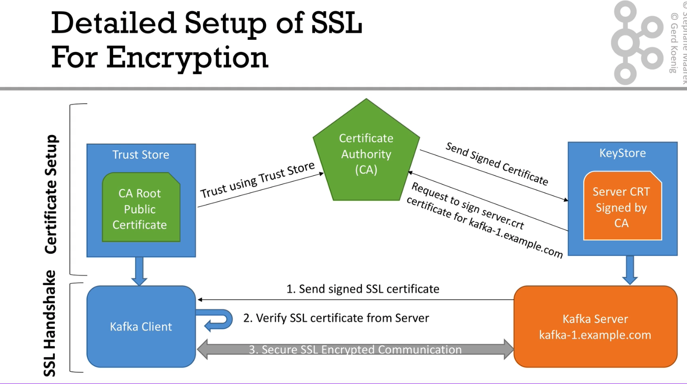
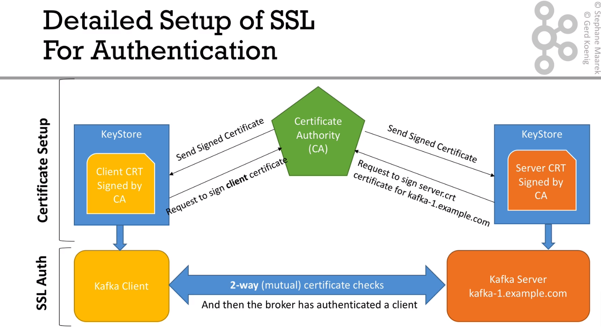

# SSL

In order to create all certificates, Key Store, and Trust Store you
just can run [`./certs-create.sh`](./certs-create.sh).

Overall, we need one Certificate Authority (CA) which will sign all certificates.
This one is an external service in real business cases.
The command creates a certificate (public) `ca-cert` and private key `ca-key`.

```shell
openssl req -new -newkey rsa:4096 -x509 -subj "/CN=Kafka-Security-CA" -keyout ca-key -out ca-cert -nodes -days 36500
```

### Key Store
It is the most critical part since it needs to route for all connections.
We set `"SAN=dns:$i,dns:localhost"` so that it can be used internally as 
well as externally. Moreover, we edit the `/etc/host` file to map localhost to broker-1 and broker-2.

We create a to-be-signed certificate and import it once it is signed together
with the public certificate of the CA.


We can check if we set up everything correctly by:
```shell
openssl s_client -connect broker-1:19093
openssl s_client -connect localhost:19093
```

To see all certificates within the Key Store execute:
```shell
keytool -list -v -keystore kafka.broker-1.keystore.jks
```

### Trust Store

In the Trust Store we just store the public certifcate of the CA


# SSL Encryption



### Certificates 

* Key Store for Kafka Broker
* Trust Store for Kafka Broker and Clients

### Setting up Broker configurations

* Add a new `advertised.listener=SSL://broker-1:19093` and open the related port.
* Mount the created stores into `/etc/kafka/secrets`
* Set the configs to
```yaml
KAFKA_SSL_KEYSTORE_FILENAME: kafka.broker-1.keystore.jks
KAFKA_SSL_KEYSTORE_CREDENTIALS: broker-1_credentials
KAFKA_SSL_KEY_CREDENTIALS: broker-1_credentials
KAFKA_SSL_TRUSTSTORE_FILENAME: kafka.broker-1.truststore.jks
KAFKA_SSL_TRUSTSTORE_CREDENTIALS: broker-1_credentials
```

### Configure Clients

We also need to add additional configurations and change the port of the `bootstrap.servers`
```kotlin
settings.setProperty(CommonClientConfigs.SECURITY_PROTOCOL_CONFIG, "SSL")
settings.setProperty(SslConfigs.SSL_TRUSTSTORE_PASSWORD_CONFIG, "confluent")
settings.setProperty(SslConfigs.SSL_TRUSTSTORE_LOCATION_CONFIG, "src/main/resources/kafka.client.truststore.jks")
```


# SSL Authentication 

It is a two-way authentication, so called mutual TLS (mTLS).
Before, only the client were verifying the broker certificates. Now, both verify each other.
Overall, we do the same process (creating and inserting certificates into the key store) as we did for the Kafka server.



### Certificates

* Key Store als for Clients

### Configure Kafka Brokers

```yaml
KAFKA_SSL_CLIENT_AUTH: "required"
```

### Configure Clients

We need to add the Key Store related configs to the properties as well.

```kotlin
settings.setProperty(SslConfigs.SSL_KEYSTORE_LOCATION_CONFIG, "src/main/resources/kafka.client.keystore.jks")
settings.setProperty(SslConfigs.SSL_KEYSTORE_PASSWORD_CONFIG, "confluent")
settings.setProperty(SslConfigs.SSL_KEY_PASSWORD_CONFIG, "confluent")
```

If we do not add them we receive the following error:
```
org.apache.kafka.common.errors.SslAuthenticationException: Failed to process post-handshake messages
Caused by: javax.net.ssl.SSLException: Tag mismatch!
```

