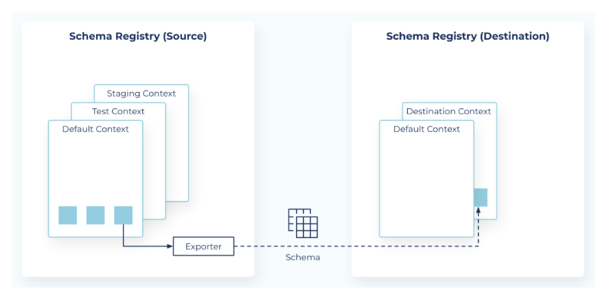

# Schema Linking



In order to link schemas, we follow the [quickstart documentation](https://docs.confluent.io/cloud/current/sr/schema-linking.html).
API Keys and endpoints are encrypted via blackbox. They need to be inserted into the [exporterConfig.txt](./exporterConfig.txt).

## Prerequisites
* We need the Stream Governance API of the destination and source environment
* We need an API Key and Secret for the destination and source environment

## Create Exporter

* In order to transfer the schemas, we need to set up an exporter, see [exporterConfig.txt](./exporterConfig.txt)
* Log in to Confluent Cloud and use the source environment
+ Create new exporter via:
```shell
confluent schema-registry exporter create patrick-sl-1 \
 --subjects "sensor-data-raw*" \
 --context-type CUSTOM \
 --context-name "staging" \
 --config-file ./exporterConfig.txt
```
This commands transfers the subject into the destination environment using 
the context `.staging`.
If you want to insert into the default context set `context-type` to `NONE`.
More information about contexts are in the [documentation](https://docs.confluent.io/cloud/current/sr/schema-linking.html#schema-contexts).


* Check exporter status via:
```shell
confluent schema-registry exporter get-status patrick-sl-1
```

## Destination Environment
In the destination environment you should now see all schemas beginning with `sensor-data-raw`
with the same version and schema ID.
Moreover, we set the context to staging, so that the exact name in the destination environment is
`:.staging:sensor-data-raw-value` `:<context>:<subject>`.

We want to produce data into the destination environment using that schema.
Therefore, we change obviously the Bootstrap Server but also the Schema Registry url.
For the Schema Registry url it is important to add the context as a suffix, like
`https://<destinationHost>/contexts/.staging`, check [documentation](https://docs.confluent.io/platform/current/schema-registry/schema-linking-cp.html#specifying-a-context-name-for-clients).

We also configure to ensure that this transferred schema is used.
```kotlin
settings[AbstractKafkaSchemaSerDeConfig.AUTO_REGISTER_SCHEMAS] = false
```